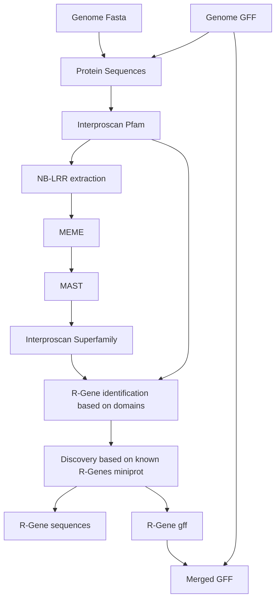

# nf-hrp

This pipeline implements the '*H*omology based *R* gene *P*rediction' workflow ([GitHub](https://github.com/AndolfoG/HRP); [Publication](https://onlinelibrary.wiley.com/doi/10.1111/tpj.15756)) in [nextflow](https://nextflow.io/). 

# Usage

The pipeline takes a gff3 file with annotations and a fasta file of the genome as input in a samplesheet and works through the steps of HRP.
The pipeline requires nextflow >= 23.04.2 to work with spack modules. It has been extensively run on biohpc_gen in the [LRZ](https://www.lrz.de/) CoolMuc2 SLURM cluster.

Running this on other infrastructure probably needs some changes to modules.

Clone this repository into e.g. ~ and do

```
nextflow run ~/nf-hrp/ --samplesheet sheet.csv --out './results' -profile biohpc_gen
```

samplesheet layout, header is important:

```
sample,fasta,gff
sample1,genome1.fasta,genome1.gff
```

# Output

The relevant gff files are `results/agat/sampleName_filtered_trascripts.[gff|bed]`, the output of the protein annotations from interproscan are in `results/interproscan/sampleName_NBLRR_gene_candidates.[gff3|tsv]`

# Graph

Graph for HRP



# Parameters

This pipeline has a single parameter: `exclude_pattern` default being `"ATMG"`.
This controls which contigs / chromosomes should be filtered from the input.
The default would filter mitochondrial genome from *A. thaliana* reference genomes.

# Notes

## Modules and configs

If I available, I have adapted modules from [nf-core](https://nf-co.re/). Nevertheless, this is not fully nf-core compatible (or nf-core endorsed) and there may be instances where I did something that is not compatible with how things are done in nf-core. Most obviously, there are no general configs, please open an issue if you need help with running this pipeline on your infrastructure.

## Implementation

I ran into some issues during implementation, I am documenting these here.

### Input genome

For `agat`, the input genome needs to be folded (because perl). This is done using `fold` with defaults (i.e. 80 characters).
This means that the name of each sequence can't be longer than 79 characters.
The sequence names should also not contain special characters (in particular commas), which cause problem during parsing of gff files.
Suggested `sed` command for fasta files is: `'s/\(>scaffold[0-9]*\).*/\1/'`, assuming the sequence names are scaffoldN followed by some other stuff.
For the gff file analogous `sed` would be: `'s/\(scaffold[0-9]*\)[A-Za-z0-9,]*/\1/'` , assuming the sequence names are scaffoldN followed by letters, numbers and commas.

### Intitial translation

I used this pipeline on automatic annotations, naturally some are broken. 

There is an option to remove a pattern from the initial gff file, e.g. I am removing "ATMG" to get rid of mitochondrial genes.

In addition, internal stop codons are stripped from protein translations, otherwise interproscan will fail. This means that there are probably some bad translations in the protein file.

I do not consider this a problem for the pipeline here, but I would not recommend using the protein.fasta generated here for other workflows.

## Changes compared to the original pipeline

Subsetting of fasta files based on lists of gene IDs (input for step 4 and step 9) is done using seqtk.

Step 8.4 (sequence lengths) is done using seqkit.

I have added SSF52540 as an nucleotide binding domain into conf1.tsv (numeric code 7 for IPS2fpG). It appears that SUPERFAMILY does assign many of the NB domains into this category and not into PF00931.

### genblastG

genblastG is not maintained anymore, the official website does not seem to exist anymore. This pipeline uses miniprot instead.

### IPS2fpGs.sh

> IPS2fpgGs.sh has been replaced with an R script that does the same, but is a bit slower.

This file is bundled in bin/, the respective conf files are in assets/, original here https://github.com/AndolfoG/HRP

It is easier for me to maintain R than bash, the overall approach is similar, keeping proteins based on the presence of NB and LRR domains, and adding in extra info based on Coil, RPW8 or TIR domains. The output from this script is a bit more informative, it retains which domains were found in the protein in `_NLR_table.tsv`, `_NLR_genes.tsv` contains only gene-id and classification.